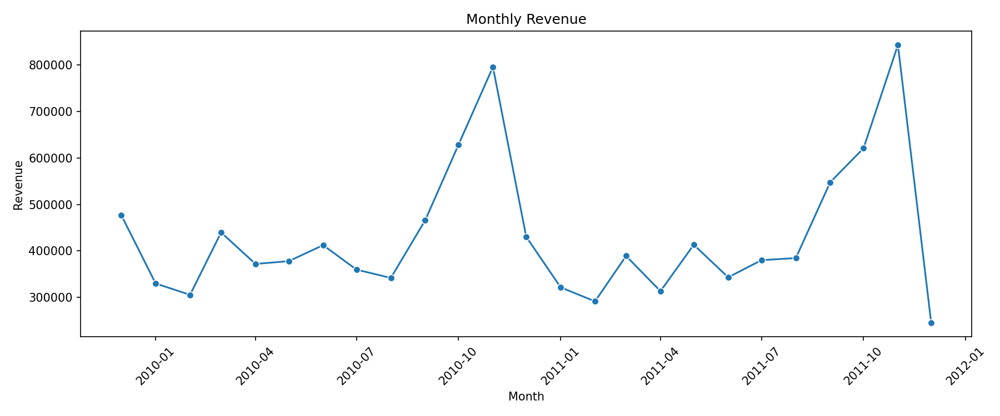
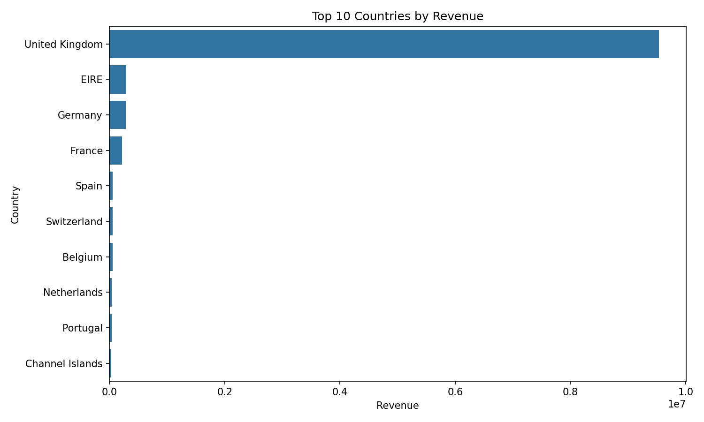
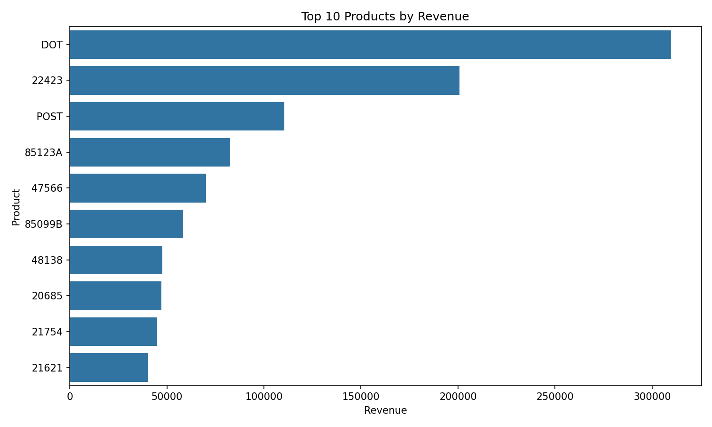

# E-Commerce Data Cleaning & Reporting Pipeline

A Python-based data pipeline for cleaning, transforming, analyzing, and generating reports from the **Online Retail II** dataset.

The project focuses on building a small, reusable ETL workflow using **Python and Pandas**.

---

## 🔄 Pipeline Overview

```text
Raw Data
   ↓
Ingestion
   ↓
Data Cleaning
   ↓
Transformation
   ↓
Analysis
   ↓
Reporting
   ↓
Processed Data & Business Reports
```

---

## 🛠️ Tech Stack

* Python
* Pandas
* NumPy
* Matplotlib
* Seaborn
* Jupyter Notebook
* Git & GitHub

---

## 📂 Project Structure

```text
ecommerce-data-pipeline/
│
├── Data/
│   ├── raw/
│   │   └── online_retail_II.csv
│   │
│   └── processed/
│       ├── clean_sales.csv
│       ├── customer_summary.csv
│       ├── product_summary.csv
│       ├── country_summary.csv
│       └── monthly_sales.csv
│
├── notebooks/
│   └── exploration.ipynb
│
├── src/
│   ├── __init__.py
│   ├── ingestion.py
│   ├── cleaning.py
│   ├── transformation.py
│   ├── analysis.py
│   ├── reporting.py
│   └── pipeline.py
│
├── reports/
│   ├── monthly_revenue.png
│   ├── top_countries.png
│   ├── top_products.png
│   ├── data_quality_report.csv
│   ├── business_summary.csv
│   └── business_insights.txt
│
├── Readme.md
└── requirements.txt
```

---

## 🔧 Pipeline Stages

### 1. Data Ingestion

The ingestion stage loads the raw CSV dataset and performs basic data inspection.

It includes:

* Loading data
* Checking dataset dimensions
* Inspecting column names and data types
* Checking missing values
* Checking duplicate records

---

### 2. Data Cleaning

The cleaning stage prepares the raw data for analysis.

Main operations:

* Remove duplicate records
* Handle missing descriptions using `StockCode`
* Detect and filter extreme quantity values
* Remove invalid prices
* Convert data types
* Clean text columns

The raw dataset remains unchanged.

---

### 3. Data Transformation

The transformation stage creates additional business-related columns:

```text
Revenue
Month
Year
Day
Hour
TransactionType
```

Revenue is calculated as:

```text
Revenue = Quantity × Price
```

Transaction classification:

```text
Quantity > 0  → Sale
Quantity < 0  → Return
```

---

### 4. Data Analysis

The pipeline generates summary datasets for:

* Customers
* Products
* Countries
* Monthly sales

It also provides functions for identifying top customers, products, and countries based on revenue.

---

## 📊 Data Visualizations

The project includes visualizations generated from the processed datasets.

### Monthly Revenue



Shows the change in revenue across months.

### Top 10 Countries by Revenue



Shows the top 10 countries based on total revenue.

### Top 10 Products by Revenue



Shows the top 10 products based on total revenue.

---

## 📑 Automated Reporting

The reporting stage automatically generates:

* Data quality report
* Business summary
* Business insights

### Generated Reports

| Report                    | Description                               |
| ------------------------- | ----------------------------------------- |
| `data_quality_report.csv` | Before/after data quality metrics         |
| `business_summary.csv`    | Main business metrics                     |
| `business_insights.txt`   | Automatically generated business insights |

---

## 📦 Processed Data

| File                   | Description                              |
| ---------------------- | ---------------------------------------- |
| `clean_sales.csv`      | Cleaned and transformed transaction data |
| `customer_summary.csv` | Revenue and quantity by customer         |
| `product_summary.csv`  | Revenue and quantity by product          |
| `country_summary.csv`  | Revenue and quantity by country          |
| `monthly_sales.csv`    | Monthly revenue and quantity             |

---

## ▶️ How to Run

### 1. Clone the repository

```bash
git clone https://github.com/abdelra-hman/ecommerce-data-pipeline.git
```

### 2. Move into the project directory

```bash
cd ecommerce-data-pipeline
```

### 3. Create a virtual environment

```bash
python -m venv .venv
```

### 4. Activate the virtual environment

Windows:

```powershell
.venv\Scripts\activate
```

### 5. Install dependencies

```powershell
pip install -r requirements.txt
```

### 6. Add the dataset

Place the raw dataset at:

```text
Data/raw/online_retail_II.csv
```

### 7. Run the pipeline

Run from the project root:

```powershell
python -m src.pipeline
```

After execution, the processed datasets and reports will be generated.

---

## ⚙️ Pipeline Design

Each stage is separated into its own module:

```text
ingestion.py
     ↓
cleaning.py
     ↓
transformation.py
     ↓
analysis.py
     ↓
reporting.py
     ↓
pipeline.py
```

The `pipeline.py` module connects all stages and runs the complete workflow automatically.

---

## 🎯 Design Principles

* Keep raw data unchanged
* Separate ingestion, cleaning, transformation, analysis, and reporting
* Use reusable functions
* Avoid hardcoded analysis results
* Store processed data separately
* Automate the complete workflow
* Generate reports automatically

---

## 🚀 Future Improvements

Possible future improvements:

* Add logging
* Add automated data validation
* Add unit tests
* Add configuration files for paths
* Add Docker support
* Schedule the pipeline with Airflow
* Move storage to a cloud data platform
* Build an interactive dashboard

---

## 👨‍💻 Author

**Abdelrahman Samir**

Software Engineering Student | Aspiring Data Engineer

[GitHub](https://github.com/abdelra-hman)
